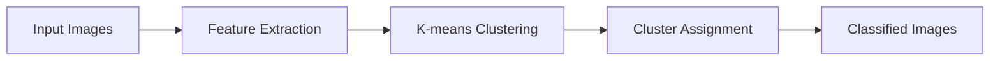

### What is K-means Clustering?

Unsupervised Learning Technique: K-means is a classic unsupervised machine learning algorithm. This means it finds patterns and structures within a dataset without needing labeled examples.
Clustering: The goal is to group similar data points together into clusters. Data points within the same cluster will have more similarity to each other than points in different clusters.
The "K": The "K" in K-means represents the number of clusters you want the algorithm to find. You specify this value in advance.

### How K-means Works (Simplified)

**Initialization:**

The algorithm starts by randomly selecting "K" points from your dataset to act as initial centroids (center points for the clusters).
**Assignment:**
Every data point in your dataset is assigned to the cluster whose centroid is nearest to it (usually using Euclidean distance).
Centroid Update:

The centroid of each cluster is recalculated by taking the average (mean) of all the data points assigned to that cluster.
**Repeat:**
Go back to step 2 and reassign the data points based on the new centroids. Then, update the centroids again. This process repeats until there's minimal change in cluster assignments or a set number of iterations is reached.

Imagine you have a dataset of customer information, and you want to discover customer segments. Here's how K-means might approach it:

**Initial Centroids:** Randomly placed centroids in the customer data.
Assignment: Customers are grouped to the closest centroid.
Update Centroids: Centroids are moved to the average position of their cluster members.
**Repeat:** The process iterates, refining the clusters.
### Key Points

**Choosing K**: Choosing the right number of clusters is crucial. Techniques like the "Elbow Method" can help make an informed decision.
**Sensitive to Initialization**: The results can vary depending on the randomly chosen initial centroids. That's why techniques like K-means++ exist to improve initialization.
**Assumptions**: K-means works best with roughly spherical clusters of similar size.
### Pros

**Simple and understandable**: Easy to implement and visualize.
**Relatively Fast:** Efficient for moderately sized datasets.
### Cons

**Fixing "K" in advance**: You need to know roughly how many clusters to expect beforehand.
Sensitive to outliers: Outliers can significantly affect cluster formation.
**Spherical clusters:** It may perform poorly if your clusters have complex shapes.
### Use Cases
**Customer Segmentation**: Group customers based on demographics, purchasing habits, etc.
**Image Compression:** Decrease the number of colors in images by clustering pixels.
**Document Clustering**: Organize documents based on topic similarity.
**Anomaly Detection:** Identify unusual data points that don't fit into well-defined clusters.
```python
import numpy as np
from sklearn.datasets import fetch_openml

mnist = fetch_openml('mnist_784') 
X = mnist.data  # Images as feature vectors
y = mnist.target  # True image labels
```
```python
from sklearn.cluster import KMeans

num_clusters = 10  # Since MNIST has digits 0-9
kmeans = KMeans(n_clusters=num_clusters)
kmeans.fit(X)  
```
```python
# ... previous steps ...

y_pred = kmeans.labels_  # Cluster assignments

# You might analyze clusters like this:
from collections import Counter
for cluster_id in range(num_clusters):
    print("Cluster", cluster_id)
    print("Dominant labels:", Counter(y[y_pred == cluster_id]).most_common(3))
```


